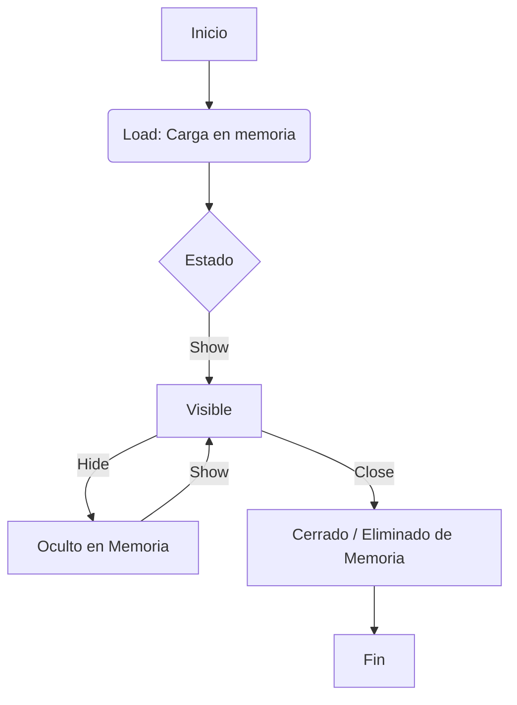
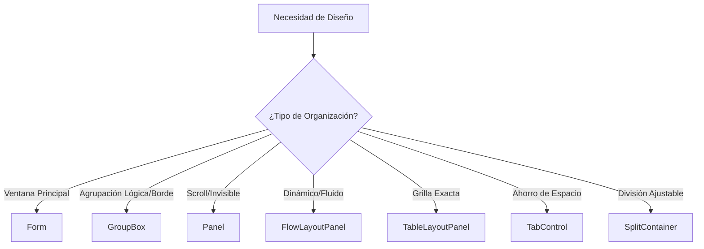

# Guía Completa de Formularios y Controles en Visual Basic .NET

## Introducción

Los **Windows Forms** son la base de las aplicaciones de escritorio en VB.NET. Esta guía te enseñará a trabajar con formularios y controles para crear interfaces gráficas interactivas y profesionales.

**¿Qué aprenderás?**
- Gestión del ciclo de vida de formularios
- Propiedades y eventos de controles esenciales
- Organización visual con contenedores
- Ejemplos prácticos de código

---

## 1. Formularios (Forms)

Los formularios son **interfaces gráficas** que permiten la interacción usuario-aplicación. Actúan como contenedores de controles y manejan eventos del usuario.

### 1.1 Ciclo de Vida y Visibilidad



### 1.2 Métodos y Eventos Principales

| Método/Evento | Descripción | Comportamiento |
|---------------|-------------|----------------|
| **Show()** | Muestra el formulario | No detiene el flujo del programa. Si ya es visible, no hace nada |
| **Hide()** | Oculta el formulario sin destruirlo | Permanece en memoria y se puede volver a mostrar con `Show()` |
| **Close()** | Cierra y elimina el formulario de la memoria | No se puede recuperar con `Show()`. Si es el formulario principal, cierra la aplicación |
| **End** | Instrucción global de terminación | Finaliza toda la ejecución inmediatamente. **No recomendada** (cierre abrupto) |
| **Load** | Evento de carga | Se ejecuta antes de mostrar el formulario. Ideal para inicializar datos y controles |

### 1.3 Ejemplo Práctico: Navegación entre Formularios

```vb
' En Form1 - Abrir Form2
Private Sub btnAbrir_Click(sender As Object, e As EventArgs) Handles btnAbrir.Click
    Dim frmSegundo As New Form2()
    frmSegundo.Show()  ' Muestra Form2 sin cerrar Form1
End Sub

' En Form2 - Evento Load para inicializar
Private Sub Form2_Load(sender As Object, e As EventArgs) Handles MyBase.Load
    lblBienvenida.Text = "Bienvenido al segundo formulario"
    txtNombre.Clear()
    ' Inicializar controles aquí
End Sub

' Ocultar formulario temporalmente
Private Sub btnOcultar_Click(sender As Object, e As EventArgs) Handles btnOcultar.Click
    Me.Hide()  ' Oculta pero permanece en memoria
End Sub

' Cerrar formulario correctamente
Private Sub btnCerrar_Click(sender As Object, e As EventArgs) Handles btnCerrar.Click
    Me.Close()  ' Cierra y libera memoria
End Sub
```

> **Tip:** Usa `ShowDialog()` en lugar de `Show()` cuando necesites que el formulario sea modal (bloquea la interacción con otros formularios hasta cerrarlo).

---

## 2. Controles - Propiedades y Uso

A continuación, los controles más utilizados con sus propiedades esenciales y ejemplos prácticos.

### 2.1 TextBox (Caja de texto)

**Descripción:** Control para entrada y edición de texto.

| Propiedad | Descripción |
|-----------|-------------|
| **Text** | Contenido escrito por usuario o programa |
| **Multiline** | `True` permite escribir en varios renglones |
| **PasswordChar** | Carácter para ocultar texto (ej. `*` para contraseñas) |
| **ReadOnly** | `True` permite leer/copiar pero no editar |
| **MaxLength** | Límite de caracteres permitidos |

**Ejemplo:**
```vb
' Validar entrada de texto
Private Sub txtNombre_TextChanged(sender As Object, e As EventArgs) Handles txtNombre.TextChanged
    If txtNombre.Text.Length > 0 Then
        lblMensaje.Text = "Caracteres: " & txtNombre.Text.Length
    End If
End Sub

' Configurar TextBox para contraseña
Private Sub Form1_Load(sender As Object, e As EventArgs) Handles MyBase.Load
    txtPassword.PasswordChar = "*"
    txtPassword.MaxLength = 20
End Sub

' Leer valor del TextBox
Private Sub btnGuardar_Click(sender As Object, e As EventArgs) Handles btnGuardar.Click
    Dim nombre As String = txtNombre.Text.Trim()
    If String.IsNullOrEmpty(nombre) Then
        MessageBox.Show("El nombre no puede estar vacío", "Error")
    Else
        MessageBox.Show("Nombre guardado: " & nombre, "Éxito")
    End If
End Sub
```

---

### 2.2 Button (Botón)

**Descripción:** Control para ejecutar acciones mediante eventos Click.

**Propiedades clave:**
- **Text:** Texto visible del botón
- **Enabled:** `False` deshabilita el botón
- **BackColor/ForeColor:** Colores de fondo y texto

**Ejemplo:**
```vb
Private Sub btnCalcular_Click(sender As Object, e As EventArgs) Handles btnCalcular.Click
    Dim numero1 As Double = Convert.ToDouble(txtNum1.Text)
    Dim numero2 As Double = Convert.ToDouble(txtNum2.Text)
    Dim resultado As Double = numero1 + numero2
    lblResultado.Text = "Resultado: " & resultado.ToString()
End Sub
```

---

### 2.3 Label (Etiqueta)

**Descripción:** Muestra texto no editable al usuario.

**Propiedades clave:**
- **Text:** Contenido de la etiqueta
- **Font:** Tipo y tamaño de fuente
- **AutoSize:** Ajusta automáticamente el tamaño

---

### 2.4 ComboBox (Lista desplegable)

**Descripción:** Lista de opciones donde el usuario selecciona una.

| Propiedad | Descripción |
|-----------|-------------|
| **Items** | Colección de opciones dentro de la lista |
| **SelectedIndex** | Índice de la opción elegida (inicia en 0; -1 es nada seleccionado) |
| **SelectedItem** | Texto o valor del objeto seleccionado |
| **DropDownStyle** | `DropDown` (permite escribir) o `DropDownList` (solo selección) |

**Ejemplo:**
```vb
' Agregar items en Load
Private Sub Form1_Load(sender As Object, e As EventArgs) Handles MyBase.Load
    cboOpciones.Items.Add("Opción 1")
    cboOpciones.Items.Add("Opción 2")
    cboOpciones.Items.Add("Opción 3")
    cboOpciones.SelectedIndex = 0  ' Seleccionar el primero
End Sub

' Leer selección
Private Sub cboOpciones_SelectedIndexChanged(sender As Object, e As EventArgs) Handles cboOpciones.SelectedIndexChanged
    If cboOpciones.SelectedIndex <> -1 Then
        MessageBox.Show("Seleccionaste: " & cboOpciones.SelectedItem.ToString())
    End If
End Sub

' Agregar desde array
Dim paises() As String = {"Guatemala", "El Salvador", "Honduras", "Nicaragua"}
cboOpciones.Items.AddRange(paises)
```

---

### 2.5 ListBox (Lista de elementos)

**Descripción:** Lista visible de elementos con o sin desplazamiento.

| Propiedad | Descripción |
|-----------|-------------|
| **Items** | Colección de datos en la lista |
| **SelectedIndex** | Posición del elemento seleccionado |
| **SelectionMode** | `One` (uno) o `MultiSimple` (varios) |
| **Sorted** | `True` ordena alfabéticamente automáticamente |

**Ejemplo:**
```vb
' Agregar elementos
lstProductos.Items.Add("Laptop")
lstProductos.Items.Add("Mouse")
lstProductos.Items.Add("Teclado")

' Obtener elemento seleccionado
Private Sub lstProductos_SelectedIndexChanged(sender As Object, e As EventArgs) Handles lstProductos.SelectedIndexChanged
    If lstProductos.SelectedIndex >= 0 Then
        Dim seleccion As String = lstProductos.SelectedItem.ToString()
        lblSeleccion.Text = "Producto: " & seleccion
    End If
End Sub

' Eliminar elemento seleccionado
Private Sub btnEliminar_Click(sender As Object, e As EventArgs) Handles btnEliminar.Click
    If lstProductos.SelectedIndex >= 0 Then
        lstProductos.Items.RemoveAt(lstProductos.SelectedIndex)
    End If
End Sub
```

---

### 2.6 CheckBox (Casilla de verificación)

**Descripción:** Opción de verdadero/falso que puede estar marcada o no.

| Propiedad | Descripción |
|-----------|-------------|
| **Checked** | `True` si está marcado, `False` si no |
| **Text** | Texto descriptivo junto a la casilla |
| **Enabled** | Si es `False`, bloquea la interacción del usuario |

**Ejemplo:**
```vb
' Verificar si está marcado
Private Sub btnProcesar_Click(sender As Object, e As EventArgs) Handles btnProcesar.Click
    If chkAceptoTerminos.Checked Then
        MessageBox.Show("Términos aceptados", "Confirmación")
    Else
        MessageBox.Show("Debes aceptar los términos", "Error")
    End If
End Sub

' Evento al cambiar estado
Private Sub chkModoOscuro_CheckedChanged(sender As Object, e As EventArgs) Handles chkModoOscuro.CheckedChanged
    If chkModoOscuro.Checked Then
        Me.BackColor = Color.Black
        Me.ForeColor = Color.White
    Else
        Me.BackColor = Color.White
        Me.ForeColor = Color.Black
    End If
End Sub
```

---

### 2.7 RadioButton (Opción única)

**Descripción:** Opciones mutuamente excluyentes (solo una puede estar seleccionada por grupo).

| Propiedad | Descripción |
|-----------|-------------|
| **Checked** | `True` seleccionado. Solo uno del grupo puede ser `True` a la vez |
| **Text** | Texto junto al círculo |
| **AutoCheck** | `True` por defecto; marca y desmarca otros automáticamente |
| **Appearance** | `Normal` (círculo) o `Button` (botón hundido) |

**Ejemplo:**
```vb
' Leer cuál está seleccionado
Private Sub btnConfirmar_Click(sender As Object, e As EventArgs) Handles btnConfirmar.Click
    Dim tamaño As String = ""
    
    If rbPequeño.Checked Then
        tamaño = "Pequeño"
    ElseIf rbMediano.Checked Then
        tamaño = "Mediano"
    ElseIf rbGrande.Checked Then
        tamaño = "Grande"
    End If
    
    MessageBox.Show("Tamaño seleccionado: " & tamaño)
End Sub

' Usar GroupBox para múltiples grupos independientes
' En GroupBox1: rbOpcion1A, rbOpcion1B
' En GroupBox2: rbOpcion2A, rbOpcion2B
' Cada GroupBox permite una selección independiente
```

---

### 2.8 PictureBox (Imágenes)

**Descripción:** Control para mostrar imágenes.

| Propiedad | Descripción |
|-----------|-------------|
| **Image** | La imagen que se visualiza |
| **SizeMode** | Ajuste de la imagen (`Zoom`, `StretchImage`, `AutoSize`, etc.) |
| **ImageLocation** | Ruta del archivo externo (ej. "C:\foto.jpg") |
| **Visible** | `True` para mostrar, `False` para ocultar |

**Ejemplo:**
```vb
' Cargar imagen desde archivo
Private Sub btnCargarImagen_Click(sender As Object, e As EventArgs) Handles btnCargarImagen.Click
    Dim openDialog As New OpenFileDialog()
    openDialog.Filter = "Archivos de Imagen|*.jpg;*.jpeg;*.png;*.bmp"
    
    If openDialog.ShowDialog() = DialogResult.OK Then
        picImagen.Image = Image.FromFile(openDialog.FileName)
        picImagen.SizeMode = PictureBoxSizeMode.Zoom
    End If
End Sub

' Limpiar imagen
Private Sub btnLimpiar_Click(sender As Object, e As EventArgs) Handles btnLimpiar.Click
    picImagen.Image = Nothing
End Sub
```

---

### 2.9 LinkLabel (Etiqueta de enlace)

**Descripción:** Etiqueta que funciona como hipervínculo.

| Propiedad | Descripción |
|-----------|-------------|
| **Text** | Texto visible del enlace |
| **LinkColor** | Color del enlace (default: azul) |
| **LinkVisited** | Si es `True`, cambia el color a "visitado" (morado) |

**Ejemplo:**
```vb
Private Sub lnkSitioWeb_LinkClicked(sender As Object, e As LinkLabelLinkClickedEventArgs) Handles lnkSitioWeb.LinkClicked
    Process.Start("https://www.ejemplo.com")
    lnkSitioWeb.LinkVisited = True
End Sub
```

---

### 2.10 MenuStrip (Menú superior)

**Descripción:** Menú de navegación en la parte superior del formulario.

| Propiedad | Descripción |
|-----------|-------------|
| **Items** | Colección de menús principales (Archivo, Editar, etc.) |
| **Text** | Texto visible de la opción |
| **ShortcutKeys** | Teclas rápidas (ej. Ctrl+S) para sub-ítems |
| **Image** | Icono junto al texto en sub-ítems |

**Ejemplo:**
```vb
' Evento Click de un elemento del menú
Private Sub archivoNuevoToolStripMenuItem_Click(sender As Object, e As EventArgs) Handles archivoNuevoToolStripMenuItem.Click
    txtContenido.Clear()
    MessageBox.Show("Nuevo documento creado")
End Sub

Private Sub archivoGuardarToolStripMenuItem_Click(sender As Object, e As EventArgs) Handles archivoGuardarToolStripMenuItem.Click
    ' Código para guardar
    MessageBox.Show("Documento guardado")
End Sub

Private Sub archivoSalirToolStripMenuItem_Click(sender As Object, e As EventArgs) Handles archivoSalirToolStripMenuItem.Click
    Me.Close()
End Sub
```

---

## 3. Contenedores - Organización de Controles

Los contenedores permiten **agrupar y organizar controles** lógica o visualmente, mejorando la estructura de tu interfaz.

### 3.1 Diagrama de Selección de Contenedor



### 3.2 Tipos de Contenedores

#### Form (Formulario)
- **Definición:** Contenedor raíz de la aplicación
- **Uso:** Ventanas de login, pantallas principales, diálogos
- **Propiedades clave:**
  - `StartPosition`: Posición inicial (`CenterScreen`, `Manual`)
  - `FormBorderStyle`: Estilo del borde
  - `MaximizeBox/MinimizeBox`: Mostrar botones de maximizar/minimizar

**Ejemplo:**
```vb
Private Sub ConfigurarFormulario()
    Me.Text = "Mi Aplicación"
    Me.StartPosition = FormStartPosition.CenterScreen
    Me.FormBorderStyle = FormBorderStyle.FixedDialog
    Me.MaximizeBox = False
End Sub
```

---

#### GroupBox (Caja de grupo)
- **Definición:** Contenedor con borde y título visible
- **Uso:** Agrupar `RadioButtons` para limitar selección única o configuraciones visualmente relacionadas
- **Ventaja:** Los RadioButtons dentro del mismo GroupBox son mutuamente excluyentes

**Ejemplo:**
```vb
' En diseño: Crear GroupBox "grpTamaño" con 3 RadioButtons
' rbPequeño, rbMediano, rbGrande

Private Sub btnProcesar_Click(sender As Object, e As EventArgs) Handles btnProcesar.Click
    ' Los RadioButtons dentro del GroupBox son independientes de otros grupos
    If rbPequeño.Checked Then
        MessageBox.Show("Tamaño pequeño seleccionado")
    End If
End Sub
```

---

#### Panel (Panel)
- **Definición:** Contenedor flexible, sin bordes por defecto
- **Uso:** Habilitar/deshabilitar bloques de controles a la vez, áreas de dibujo con `AutoScroll`
- **Propiedades clave:**
  - `AutoScroll`: Agrega scroll automático si el contenido es más grande
  - `BorderStyle`: Agregar borde si se necesita

**Ejemplo:**
```vb
' Habilitar/Deshabilitar todos los controles de un Panel
Private Sub chkHabilitarEdicion_CheckedChanged(sender As Object, e As EventArgs)
    pnlFormulario.Enabled = chkHabilitarEdicion.Checked
    ' Esto afecta a TODOS los controles dentro del Panel
End Sub

' Panel con scroll
Private Sub Form1_Load(sender As Object, e As EventArgs) Handles MyBase.Load
    pnlContenido.AutoScroll = True
End Sub
```

---

#### FlowLayoutPanel (Panel de flujo)
- **Definición:** Organiza controles dinámicamente en secuencia (horizontal o vertical)
- **Uso:** Galerías de imágenes, listas que deben adaptarse al tamaño de ventana
- **Propiedades clave:**
  - `FlowDirection`: Dirección del flujo (`LeftToRight`, `TopDown`)
  - `WrapContents`: Si es `True`, hace salto de línea automático

**Ejemplo:**
```vb
' Agregar botones dinámicamente
Private Sub btnAgregarBoton_Click(sender As Object, e As EventArgs) Handles btnAgregarBoton.Click
    Dim nuevoBoton As New Button()
    nuevoBoton.Text = "Botón " & (flpContenedor.Controls.Count + 1).ToString()
    nuevoBoton.Size = New Size(80, 30)
    flpContenedor.Controls.Add(nuevoBoton)
    ' Se organizan automáticamente en flujo
End Sub
```

---

#### TableLayoutPanel (Panel de tabla)
- **Definición:** Grilla de filas y columnas definidas
- **Uso:** Formularios de entrada de datos que requieren alineación precisa
- **Propiedades clave:**
  - `RowCount/ColumnCount`: Número de filas y columnas
  - `ColumnStyles/RowStyles`: Tamaños de cada columna/fila

**Ejemplo:**
```vb
' Agregar controles a celdas específicas
Private Sub ConfigurarTabla()
    ' TableLayoutPanel con 3 filas y 2 columnas
    ' Columna 1: Labels, Columna 2: TextBoxes
    
    Dim lblNombre As New Label()
    lblNombre.Text = "Nombre:"
    lblNombre.Dock = DockStyle.Fill
    tlpFormulario.Controls.Add(lblNombre, 0, 0)  ' Columna 0, Fila 0
    
    Dim txtNombre As New TextBox()
    txtNombre.Dock = DockStyle.Fill
    tlpFormulario.Controls.Add(txtNombre, 1, 0)  ' Columna 1, Fila 0
End Sub
```

---

#### TabControl (Control de pestañas)
- **Definición:** Sistema de pestañas independientes
- **Uso:** Organizar muchos controles en espacio reducido (configuraciones por categorías)
- **Propiedades clave:**
  - `TabPages`: Colección de pestañas
  - `SelectedIndex`: Pestaña actualmente seleccionada
  - `SelectedTab`: Objeto TabPage seleccionado

**Ejemplo:**
```vb
' Cambiar de pestaña por código
Private Sub btnIrAPestaña2_Click(sender As Object, e As EventArgs) Handles btnIrAPestaña2.Click
    tabControl1.SelectedIndex = 1  ' Ir a la segunda pestaña (índice 1)
End Sub

' Evento al cambiar de pestaña
Private Sub tabControl1_SelectedIndexChanged(sender As Object, e As EventArgs) Handles tabControl1.SelectedIndexChanged
    Select Case tabControl1.SelectedIndex
        Case 0
            MessageBox.Show("Estás en la pestaña General")
        Case 1
            MessageBox.Show("Estás en la pestaña Configuración")
    End Select
End Sub
```

---

#### SplitContainer (Contenedor dividido)
- **Definición:** Divide un área en dos paneles ajustables mediante una barra divisora
- **Uso:** Interfaces tipo explorador (árbol a la izquierda, contenido a la derecha)
- **Propiedades clave:**
  - `Orientation`: `Horizontal` o `Vertical`
  - `SplitterDistance`: Posición de la barra divisora
  - `Panel1/Panel2`: Acceso a cada panel

**Ejemplo:**
```vb
' Configurar SplitContainer
Private Sub Form1_Load(sender As Object, e As EventArgs) Handles MyBase.Load
    splitContainer1.Orientation = Orientation.Vertical
    splitContainer1.SplitterDistance = 200  ' Panel izquierdo de 200px
    
    ' Agregar controles a cada panel
    Dim treeView1 As New TreeView()
    treeView1.Dock = DockStyle.Fill
    splitContainer1.Panel1.Controls.Add(treeView1)
    
    Dim txtContenido As New TextBox()
    txtContenido.Multiline = True
    txtContenido.Dock = DockStyle.Fill
    splitContainer1.Panel2.Controls.Add(txtContenido)
End Sub
```

---

## 4. Mejores Prácticas y Tips

### 4.1 Nomenclatura de Controles
Usa prefijos para identificar fácilmente el tipo de control:

| Prefijo | Control | Ejemplo |
|---------|---------|---------|
| `txt` | TextBox | `txtNombre`, `txtEdad` |
| `btn` | Button | `btnGuardar`, `btnCancelar` |
| `lbl` | Label | `lblTitulo`, `lblResultado` |
| `cbo` | ComboBox | `cboOpciones`, `cboPais` |
| `lst` | ListBox | `lstProductos`, `lstClientes` |
| `chk` | CheckBox | `chkAceptar`, `chkActivo` |
| `rb` | RadioButton | `rbMasculino`, `rbFemenino` |
| `pic` | PictureBox | `picLogo`, `picFoto` |
| `grp` | GroupBox | `grpDatos`, `grpOpciones` |
| `pnl` | Panel | `pnlFormulario`, `pnlMenu` |

### 4.2 Validación de Datos
```vb
' Validar antes de procesar
Private Function ValidarFormulario() As Boolean
    If String.IsNullOrWhiteSpace(txtNombre.Text) Then
        MessageBox.Show("El nombre es obligatorio", "Error", MessageBoxButtons.OK, MessageBoxIcon.Error)
        txtNombre.Focus()
        Return False
    End If
    
    If Not IsNumeric(txtEdad.Text) Then
        MessageBox.Show("La edad debe ser un número", "Error", MessageBoxButtons.OK, MessageBoxIcon.Error)
        txtEdad.Focus()
        Return False
    End If
    
    Return True
End Function

Private Sub btnGuardar_Click(sender As Object, e As EventArgs) Handles btnGuardar.Click
    If ValidarFormulario() Then
        ' Procesar datos
        MessageBox.Show("Datos guardados correctamente", "Éxito", MessageBoxButtons.OK, MessageBoxIcon.Information)
    End If
End Sub
```

### 4.3 Eventos Comunes Importantes

| Evento | Cuándo ocurre | Uso común |
|--------|---------------|-----------|
| **Click** | Al hacer clic en un control | Botones, Labels, PictureBox |
| **TextChanged** | Al cambiar el texto | Validación en tiempo real |
| **SelectedIndexChanged** | Al cambiar la selección | ComboBox, ListBox |
| **CheckedChanged** | Al cambiar el estado | CheckBox, RadioButton |
| **KeyPress** | Al presionar una tecla | Validar entrada de caracteres |
| **FormClosing** | Antes de cerrar el formulario | Confirmar cierre, guardar datos |
| **Load** | Al cargar el formulario | Inicializar controles |

### 4.4 Ejemplo Completo: Formulario de Registro

```vb
Public Class FormRegistro
    Private Sub FormRegistro_Load(sender As Object, e As EventArgs) Handles MyBase.Load
        ' Inicializar ComboBox de países
        cboPais.Items.AddRange({"Guatemala", "El Salvador", "Honduras"})
        cboPais.SelectedIndex = 0
        
        ' Configurar TextBox de edad solo para números
        txtEdad.MaxLength = 3
    End Sub
    
    ' Validar que solo se ingresen números en edad
    Private Sub txtEdad_KeyPress(sender As Object, e As KeyPressEventArgs) Handles txtEdad.KeyPress
        If Not Char.IsDigit(e.KeyChar) AndAlso e.KeyChar <> Convert.ToChar(Keys.Back) Then
            e.Handled = True  ' Cancelar la tecla
        End If
    End Sub
    
    ' Habilitar botón solo si se aceptan términos
    Private Sub chkTerminos_CheckedChanged(sender As Object, e As EventArgs) Handles chkTerminos.CheckedChanged
        btnRegistrar.Enabled = chkTerminos.Checked
    End Sub
    
    ' Procesar registro
    Private Sub btnRegistrar_Click(sender As Object, e As EventArgs) Handles btnRegistrar.Click
        If ValidarFormulario() Then
            Dim mensaje As String = String.Format(
                "Registro exitoso:{0}Nombre: {1}{0}Edad: {2}{0}País: {3}",
                Environment.NewLine,
                txtNombre.Text,
                txtEdad.Text,
                cboPais.SelectedItem.ToString()
            )
            MessageBox.Show(mensaje, "Éxito", MessageBoxButtons.OK, MessageBoxIcon.Information)
            LimpiarFormulario()
        End If
    End Sub
    
    Private Function ValidarFormulario() As Boolean
        If String.IsNullOrWhiteSpace(txtNombre.Text) Then
            MessageBox.Show("Ingrese un nombre", "Error", MessageBoxButtons.OK, MessageBoxIcon.Warning)
            Return False
        End If
        
        If String.IsNullOrWhiteSpace(txtEdad.Text) Then
            MessageBox.Show("Ingrese la edad", "Error", MessageBoxButtons.OK, MessageBoxIcon.Warning)
            Return False
        End If
        
        Dim edad As Integer = Convert.ToInt32(txtEdad.Text)
        If edad < 18 Or edad > 120 Then
            MessageBox.Show("La edad debe estar entre 18 y 120 años", "Error", MessageBoxButtons.OK, MessageBoxIcon.Warning)
            Return False
        End If
        
        Return True
    End Function
    
    Private Sub LimpiarFormulario()
        txtNombre.Clear()
        txtEdad.Clear()
        cboPais.SelectedIndex = 0
        chkTerminos.Checked = False
        txtNombre.Focus()
    End Sub
End Class
```

---

## 5. Recursos Adicionales

### Atajos de Teclado útiles en Visual Studio
- `F5`: Ejecutar aplicación
- `Shift + F5`: Detener depuración
- `F7`: Ver código del formulario
- `Shift + F7`: Ver diseñador de formulario
- `Ctrl + K, Ctrl + C`: Comentar código
- `Ctrl + K, Ctrl + U`: Descomentar código

### Propiedades Comunes a Todos los Controles
- **Name**: Nombre del control en código
- **Enabled**: Habilitar/Deshabilitar
- **Visible**: Mostrar/Ocultar
- **Location**: Posición (X, Y)
- **Size**: Tamaño (Width, Height)
- **Anchor**: Anclaje al redimensionar
- **Dock**: Acoplamiento al contenedor
- **TabIndex**: Orden de navegación con Tab
- **Font**: Fuente del texto
- **BackColor/ForeColor**: Colores de fondo y texto

---

## Conclusión

Esta guía cubre los fundamentos esenciales de formularios y controles en VB.NET Windows Forms. Practica creando aplicaciones pequeñas que combinen diferentes controles y contenedores para dominar estos conceptos.

**Recuerda:**
- Usa nombres descriptivos para tus controles
- Valida siempre los datos del usuario
- Organiza tu interfaz con contenedores apropiados
- Maneja los eventos de forma clara y ordenada
- Comenta tu código para facilitar el mantenimiento

**Próximos pasos:**
- Aprende sobre cuadros de diálogo personalizados
- Explora el manejo de excepciones (Try-Catch)
- Estudia conexión a bases de datos con ADO.NET
- Investiga sobre herencia de formularios