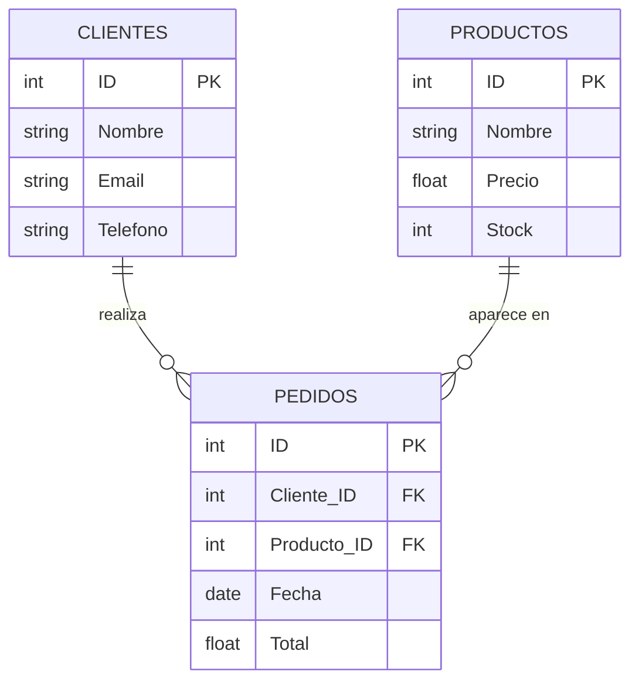
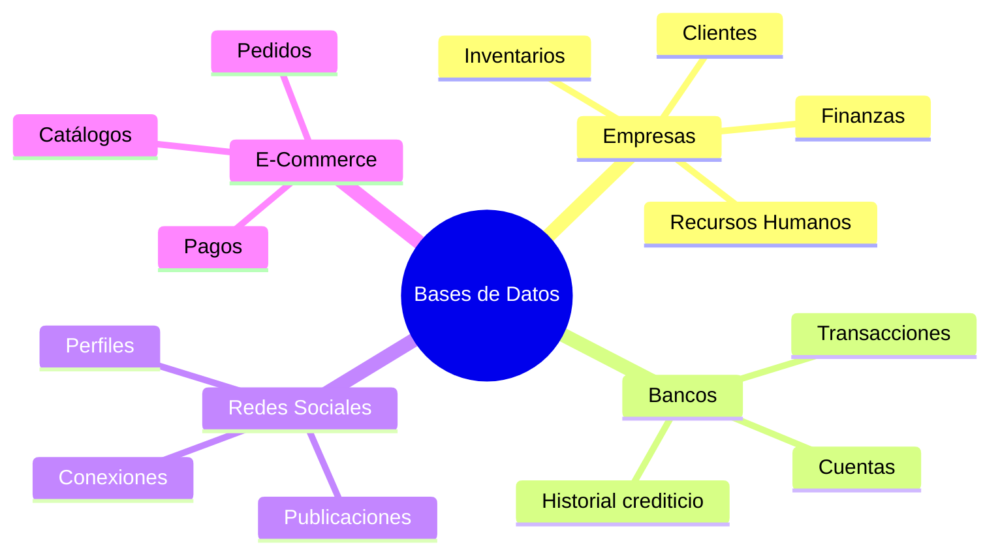
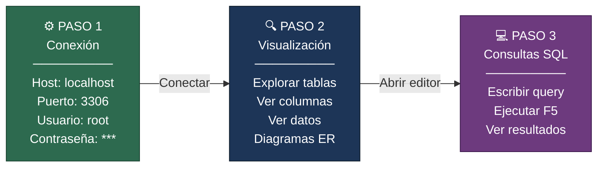
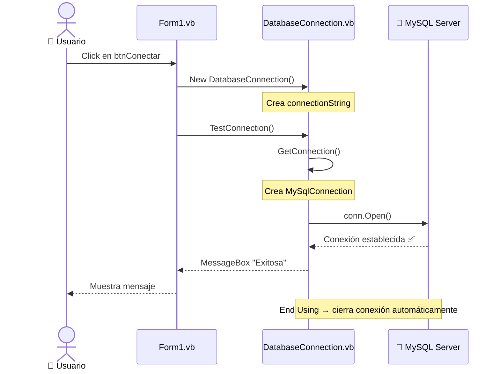
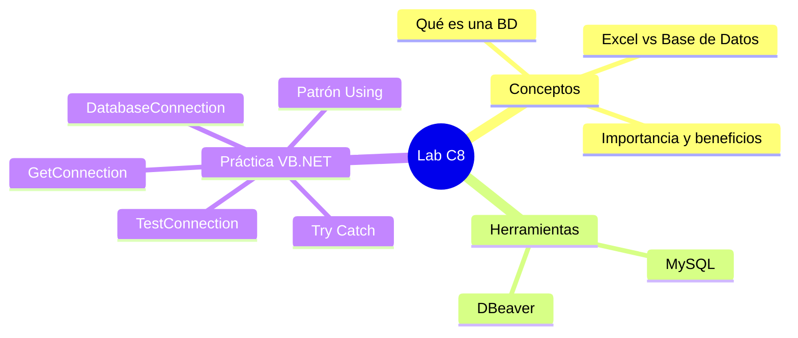

# 🗄️ Introducción a las Bases de Datos
### Guía de Estudio — Programación de Computadoras 2 P
> **Josué Alejandro Pérez Benito** · Martes, 17 de marzo · 12:20 p.m.

---

## 📋 Contenido

1. [¿Qué es una Base de Datos?](#1-qué-es-una-base-de-datos)
2. [Importancia y Beneficios](#2-importancia-y-beneficios)
3. [Excel vs Base de Datos](#3-excel-vs-base-de-datos)
4. [Introducción a MySQL](#4-introducción-a-mysql)
5. [Herramienta: DBeaver](#5-herramienta-dbeaver)
6. [Ejercicio Práctico: Conexión con VB.NET + Windows Forms](#6-ejercicio-práctico-conexión-con-vbnet--windows-forms)
7. [Resumen Final](#7-resumen-final)

---

## 1. ¿Qué es una Base de Datos?

> 💡 **Definición:** Una base de datos es un sistema organizado que permite **almacenar, gestionar y recuperar** información de manera eficiente.

Piensa en ella como un **archivero digital inteligente** donde la información está estructurada y lista para ser consultada en cualquier momento.

### Ejemplos del mundo real

| Caso de uso | Qué almacena |
|---|---|
| 📱 Agenda de Contactos | Nombres, teléfonos, correos |
| 🛒 Catálogo de Productos | Inventario, precios, descripciones |
| 💰 Registros de Ventas | Transacciones, fechas, montos |
| 🎓 Lista de Estudiantes | Datos académicos y personales |

### Estructura básica — Tablas relacionadas

Una base de datos organiza la información en **tablas** con filas (registros) y columnas (campos). Por ejemplo, un sistema de ventas podría verse así:



> **PK** = Primary Key (clave primaria, identifica cada fila de forma única)
> **FK** = Foreign Key (clave foránea, conecta tablas entre sí)

---

## 2. Importancia y Beneficios

### ¿Dónde se usan las bases de datos?



### Los 5 beneficios clave

| # | Beneficio | ¿Qué significa? |
|---|---|---|
| 1 | 🛡️ **Integridad de Datos** | Evitan inconsistencias mediante reglas y restricciones |
| 2 | 🔒 **Seguridad** | Control de acceso, autenticación, permisos y encriptación |
| 3 | 📈 **Escalabilidad** | Crecen con el negocio, de cientos a millones de registros |
| 4 | 👥 **Acceso Multiusuario** | Múltiples usuarios simultáneos sin conflictos |
| 5 | 🤖 **Automatización** | Consultas y reportes mediante SQL, ahorrando tiempo |

---

## 3. Excel vs Base de Datos

Este es uno de los puntos más importantes de la clase. Muchos empiezan usando Excel para guardar datos, pero tiene límites claros.

### Tabla comparativa

| Aspecto | 📊 Excel | 🗄️ Base de Datos |
|---|---|---|
| **Cantidad de Datos** | Limitado (~1M filas) | Ilimitado |
| **Relaciones** | Manuales (BUSCARV) | Automáticas (SQL JOIN) |
| **Seguridad** | Básica (contraseña) | Avanzada (roles, permisos) |
| **Multiusuario** | Limitado (bloqueos) | Simultáneo sin conflictos |
| **Automatización** | Macros (limitadas) | Consultas SQL (potentes) |
| **Integridad** | Sin validación automática | Restricciones y reglas |
| **Rendimiento** | Lento con grandes volúmenes | Óptimo siempre |

### Limitaciones concretas de Excel como "base de datos"

- ⚠️ **Grandes volúmenes**: Se vuelve lento e inestable con +1 millón de filas
- ⚠️ **Duplicados**: No hay validación automática para evitar registros repetidos
- ⚠️ **Relaciones complejas**: BUSCARV es lento y propenso a errores
- ⚠️ **Seguridad débil**: La protección por contraseña es fácil de romper
- ⚠️ **Multiusuario**: Conflictos y pérdida de datos al editar simultáneamente
- ⚠️ **Sin integridad**: No garantiza que los datos sean consistentes

> ✅ **Conclusión:** Excel es ideal para análisis simples y uso individual. Las bases de datos son para **sistemas profesionales y colaborativos**.

---

## 4. Introducción a MySQL

> **MySQL** es un sistema de gestión de bases de datos relacional (**SGBDR**), de código abierto y **gratuito**.

Es uno de los más populares del mundo. Lo usan empresas como:

```
Facebook   Twitter   YouTube   WordPress   Netflix   Uber
```

### ¿Para qué se usa MySQL?

- 🌐 **Aplicaciones Web**: sitios dinámicos, CMS, blogs
- 🛒 **Comercio Electrónico**: tiendas, pagos, inventarios
- 🏢 **Sistemas Empresariales**: ERP, CRM, gestión interna
- 📱 **Apps Móviles**: backend para aplicaciones móviles

### Conceptos clave de MySQL

```sql
-- Crear una base de datos
CREATE DATABASE zoo;

-- Usar la base de datos
USE zoo;

-- Crear una tabla
CREATE TABLE animales (
    id INT PRIMARY KEY AUTO_INCREMENT,
    nombre VARCHAR(100) NOT NULL,
    especie VARCHAR(100),
    edad INT
);

-- Insertar datos
INSERT INTO animales (nombre, especie, edad) VALUES ('León', 'Panthera leo', 5);

-- Consultar datos
SELECT * FROM animales;
```

---

## 5. Herramienta: DBeaver

> **DBeaver** es una herramienta universal, **gratuita y de código abierto** para administrar bases de datos.

### Características principales

- 🖥️ **Multiplataforma**: Windows, Mac, Linux
- 🔌 **Compatible con**: MySQL, PostgreSQL, Oracle, SQL Server, SQLite, MongoDB y más
- ✨ **Funciones**: Conexión a BD, visualización de tablas, ejecución SQL, importar/exportar

### Flujo de trabajo con DBeaver + MySQL



> 💡 **Tip:** DBeaver tiene **autocompletado** de SQL, lo que facilita enormemente el aprendizaje.

---

## 6. Ejercicio Práctico: Conexión con VB.NET + Windows Forms

Este es el ejercicio del laboratorio. Vamos a conectar una aplicación de Windows Forms (Visual Basic .NET) con nuestra base de datos MySQL.

### Prerrequisitos

Antes de escribir código, necesitas:

1. ✅ MySQL Server instalado y corriendo
2. ✅ La base de datos `zoo` creada en MySQL
3. ✅ El paquete NuGet `MySqlConnector` agregado al proyecto

### Instalar MySqlConnector

En Visual Studio, abre la **Consola del Administrador de Paquetes** y ejecuta:

```
Install-Package MySqlConnector
```

O ve a: `Proyecto → Administrar paquetes NuGet → Buscar "MySqlConnector" → Instalar`

---

### El código: `DatabaseConnection.vb`

```vb
' Importamos la librería del conector de MySQL
Imports MySqlConnector

' Clase que gestiona la conexión con la base de datos MySQL
Public Class DatabaseConnection
    Private connectionString As String

    ' Constructor de la clase: define la cadena de conexión
    Public Sub New()
        ' ⚠️ Cambia estos valores según tu entorno
        connectionString = "Server=localhost;Database=zoo;Uid=root;Pwd=AleJos121824-67;Allow User Variables=True"
    End Sub

    ' Método que devuelve una conexión lista para usarse
    Public Function GetConnection() As MySqlConnection
        Return New MySqlConnection(connectionString)
    End Function

    ' Método para probar si la conexión funciona correctamente
    Public Function TestConnection() As Boolean
        Try
            Using conn As MySqlConnection = GetConnection()
                conn.Open()
                MessageBox.Show("✅ Conexión exitosa a la base de datos.")
                Return True
            End Using
        Catch ex As Exception
            MessageBox.Show($"❌ Error de conexión: {ex.Message}" & vbCrLf &
                           "Verifica que MySQL esté ejecutándose y las credenciales sean correctas.")
            Return False
        End Try
    End Function
End Class
```

### Desglose línea por línea

#### `Imports MySqlConnector`
Importa el espacio de nombres del paquete que instalamos. Sin esta línea, VB no reconoce `MySqlConnection`.

#### La cadena de conexión (`connectionString`)
```
"Server=localhost;Database=zoo;Uid=root;Pwd=TuContraseña;Allow User Variables=True"
```

| Parámetro | Valor | Descripción |
|---|---|---|
| `Server` | `localhost` | El servidor MySQL está en esta misma PC |
| `Database` | `zoo` | Nombre de la base de datos a usar |
| `Uid` | `root` | Usuario de MySQL |
| `Pwd` | `***` | Contraseña del usuario |
| `Allow User Variables` | `True` | Permite variables de usuario en queries |

> ⚠️ **Importante:** En proyectos reales, **nunca** pongas la contraseña directamente en el código. Usa archivos de configuración o variables de entorno.

#### `GetConnection()`
Este método crea y devuelve un objeto `MySqlConnection`. **No abre la conexión todavía**, solo la prepara. Se abre cuando llamamos `.Open()`.

#### `TestConnection()` — el patrón `Using`
```vb
Using conn As MySqlConnection = GetConnection()
    conn.Open()
    ' ... usar la conexión ...
End Using  ' ← La conexión se cierra AUTOMÁTICAMENTE aquí
```

El bloque `Using` garantiza que la conexión **siempre se cierre**, incluso si ocurre un error. Esto es crucial para no desperdiciar recursos del servidor.

#### Manejo de errores con `Try/Catch`
```vb
Try
    ' Intenta abrir la conexión
    conn.Open()
Catch ex As Exception
    ' Si algo sale mal, muestra el error
    MessageBox.Show($"❌ Error: {ex.Message}")
End Try
```

Esto evita que la aplicación se "caiga" si MySQL no está corriendo o las credenciales son incorrectas.

---

### Cómo usar la clase desde un Form

```vb
' En tu Form1.vb o cualquier formulario:
Public Class Form1

    Private Sub btnConectar_Click(sender As Object, e As EventArgs) Handles btnConectar.Click
        ' Crear una instancia de nuestra clase de conexión
        Dim db As New DatabaseConnection()
        
        ' Probar la conexión
        db.TestConnection()
    End Sub

End Class
```

### Diagrama del flujo de conexión



---

### Errores comunes y cómo resolverlos

| Error | Causa probable | Solución |
|---|---|---|
| `Unable to connect to any of the specified MySQL hosts` | MySQL no está corriendo | Inicia el servicio MySQL |
| `Access denied for user 'root'` | Contraseña incorrecta | Verifica las credenciales |
| `Unknown database 'zoo'` | La BD no existe | Crea la base de datos en DBeaver |
| `MySqlConnector not found` | Falta el paquete NuGet | Instala `MySqlConnector` vía NuGet |

---

## 7. Resumen Final

### Lo que aprendimos hoy



### Lo que viene en el curso

- 📐 Diseño de bases de datos (modelado y normalización)
- 🔍 SQL avanzado (SELECT, JOIN, GROUP BY, subconsultas)
- 🔒 Normalización (1FN, 2FN, 3FN)
- 💻 Proyectos prácticos con VB.NET + MySQL

---

> 🚀 **"La mejor manera de aprender es haciendo."**
> Instala MySQL y DBeaver, crea tu primera base de datos y conéctala desde Visual Basic.
> ¡A practicar!

---

*Programación de Computadoras 2 P · ECYS · Universidad de San Carlos de Guatemala*